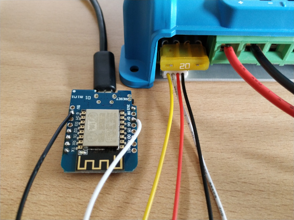

# VictronMPPT-ESPHOME 

ESPHome component to monitor a Victron device _(MPPT, SmarShunt, BMV, Phoenix Inverter ... )_ via ve.direct / UART TTL

## Supported devices

All Victron devices providing a ve.direct port.

## Tested devices

  * Victron SmartSolar MPPT 75/15
  * Victron SmartSolar MPPT 100/15
  * Victron SmartSolar MPPT 100/20
  * Victron BlueSolar  MPPT 100/30
  * Victron SmartSolar MPPT 150/35
  * Victron SmartSolar MPPT 150/45
  * Victron SmartSolar MPPT 150/60
  * Victron SmartSolar MPPT VE.Can 150/100 rev2 (Using VE.Direct port)
  * Victron SmartSolar MPPT 250/70
  * Victron Phoenix Inverter 12/500
   
  * Victron SmartShunt 500A/50mV

## Requirements

* [ESPHome 2021.10 or higher](https://github.com/esphome/esphome/releases).
* Generic ESP32 or ESP8266 board

## Schematics

Attention: [The TX voltage of the VE.Direct interface depends on the product: Some are 5V, others 3.3V!](https://www.victronenergy.com/live/vedirect_protocol:faq#q4is_the_vedirect_interface_33_or_5v)

Please measure the voltage between TX and GND. In case of a logic level of 5V you should add a voltage divider or logic level converter between the ESP and the Victron device.

```
                UART-TTL
┌────────────────┐                ┌──────────────────┐
│           GND o│<-------------->│o GND             │
│ Victron    TX o│--------------->│o D7   ESP32/     │
│ Charger    RX o│                │       ESP8266    │<-- GND
│            5V o│                │                  │<-- 3.3V
└────────────────┘                └──────────────────┘

# UART-TTL jack (JST-PH 2.0mm pinch)
┌─── ─────── ────┐
│                │
│ O   O   O   O  │
│GND  RX  TX VCC │
└────────────────┘
```

If you are unsure about to pin order please measure the voltage between GND and VCC (5V). If you measure a positive voltage you know the position of VCC and GND!

### JST-PH jack

| Pin     | Purpose      | ESP pin        |
| :-----: | :----------- | :------------- |
|  **1**  | **GND**      | GND            |
|    2    | RX           |                |
|  **3**  | **TX**       | D7 (RX)        |
|    4    | 5V           |                |

<a href="images/circuit.jpg" target="_blank">

</a>

## Installation

You can install this component with [ESPHome external components feature](https://esphome.io/components/external_components.html) like this:
```yaml
external_components:
  - source: github://KinDR007/VictronMPPT-ESPHOME@main

uart:
  id: uart_0
  tx_pin: D8  # Not used! The communication is read-only
  rx_pin: D7
  baud_rate: 19200
  rx_buffer_size: 256

victron:
  id: victron0
  uart_id: uart_0

sensor:
  - platform: victron
    victron_id: victron0
    panel_voltage:
      name: "Panel voltage"
    battery_voltage:
      name: "Battery voltage"
    battery_current:
      name: "Battery current"
```

or just use the `esp8266-example.yaml` as proof of concept:

```bash
# Install esphome
pip3 install esphome

# Clone this external component
git clone https://github.com/KinDR007/VictronMPPT-ESPHOME.git
cd VictronMPPT-ESPHOME

# Create a secret.yaml containing some setup specific secrets
cat > secrets.yaml <<EOF
mqtt_host: MY_MQTT_HOST
mqtt_username: MY_MQTT_USERNAME
mqtt_password: MY_MQTT_PASSWORD

wifi_ssid: MY_WIFI_SSID
wifi_password: MY_WIFI_PASSWORD
EOF

# Validate the configuration, create a binary, upload it, and start logs
esphome run esp8266-example.yaml

```

The `uart_id` and `victron_id` is optional if you use a single UART / victron device. All sensors are optional.

The victron device pushs one status message per second. To reduce the update interval of the ESPHome entities please use the `throttle` parameter to discard some messages.

The available numeric sensors are:
- `max_power_yesterday`
- `max_power_today`
- `yield_total`
- `yield_yesterday`
- `yield_today`
- `panel_voltage`
- `panel_power`
- `battery_voltage`
- `battery_voltage_2`
- `battery_voltage_3`
- `battery_current`
- `battery_current_2`
- `battery_current_3`
- `day_number`
- `charging_mode_id`
- `error_code`
- `tracking_mode_id`
- `load_current`
- `ac_out_voltage`
- `ac_out_current`
- `ac_out_apparent_power`
- `device_mode_id`
- `warning_code`
- `battery_temperature`
- `instantaneous_power`
- `consumed_amp_hours`
- `state_of_charge`
- `time_to_go`
- `depth_of_the_deepest_discharge`
- `depth_of_the_last_discharge`
- `depth_of_the_average_discharge`
- `number_of_charge_cycles`
- `number_of_full_discharges`
- `cumulative_amp_hours_drawn`
- `min_battery_voltage`
- `max_battery_voltage`
- `last_full_charge`
- `number_of_automatic_synchronizations`
- `number_of_low_main_voltage_alarms`
- `number_of_high_main_voltage_alarms`
- `number_of_low_auxiliary_voltage_alarms`
- `number_of_high_auxiliary_voltage_alarms`
- `min_auxiliary_battery_voltage`
- `max_auxiliary_battery_voltage`
- `amount_of_discharged_energy`
- `amount_of_charged_energy`

The available text sensors are:
- `charging_mode`
- `error`
- `tracking_mode`
- `firmware_version`
- `device_type`
- `device_mode`
- `warning`
- `alarm_condition_active`
- `alarm_reason`
- `model_description`

Binary sensors:

- `load_state`
- `relay_state`

Big thanks for help to ssieb for the support!


## Debugging

If this component doesn't work out of the box for your device please flash the `debug-esp8266-example.yaml` and create an issue providing the full ESPHome log.

```
esphome run debug-esp8266-example.yaml
```
